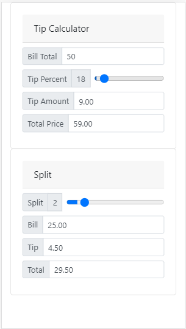

# Tip Calculator

> A simple vanilla javascript tip caluculator styled with bootstrap.

Based on an exercise in learning javascript.  An afternoon's entertainment.



## Installation

```sh
git clone https://github.com/c-healey/tip-calculator.git
```

## Usage example

- Enter the amount of your bill, adjust the tip percent to see the  total amount due. 
- If dining with friends and you want to split the bill, slide the 'Split' slider to your parties number. 
Each share of the bill and tip is calculated and shown.

## Development setup

Not much is needed to run or modify as everything runs in the browser. 
A connection is needed to pull in the Bootstrap style sheet.


## Release History

- 0.0.1
  - Work in progress

## Meta

Catherine Healey – [@cfhealey](https://twitter.com/cfhealey) – cathy.healey@gmail.com

Distributed under the MIT license. See `LICENSE` for more information.

[Visit Tip Calculator](https://c-healey.github.io/tip-calculator/index.html)
